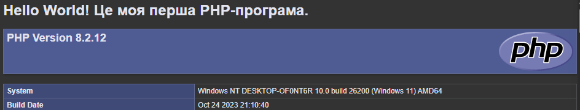

# Лабораторна робота №1

## 1. Фрагмент коду 
```php
<?php
  echo "<h1>Hello World! Це моя перша PHP-програма.</h1>";
  phpinfo();
?>
```



## 3. Відповіді на контрольні запитання

* **Яке призначення вебсервера (наприклад, Apache) у процесі веброзробки?**
  Він приймає запити від браузера, знаходить файли сайту на комп'ютері, запускає PHP-код та віддає готову вебсторінку назад у браузер користувачу

* **Яким розширенням файлу повинен володіти скрипт, щоб сервер обробив його як PHP-код?**
  Файл повинен мати розширення **`.php`**

* **Чому PHP-файл потрібно відкривати через браузер за адресою localhost, а не просто подвійним кліком миші у файловому менеджері?**
  Якщо клікнути двічі, файл відкриється просто як текст. Адреса `localhost` змушує браузер звернутися до вебсервера, який спочатку обробляє PHP-код, перетворює його на HTML і тоді показує сайт

* **За що відповідає конструкція echo у PHP?**
  Вона відповідає за виведення тексту, чисел або HTML-коду на екран браузера

* **Яку інформацію виводить функція phpinfo() і для чого вона може знадобитись?**
  Вона виводить повну інформацію про поточні налаштування PHP, версію мови та підключені модулі. Це потрібно для перевірки,  правильності налаштування серверу і які функції на ньому доступні
