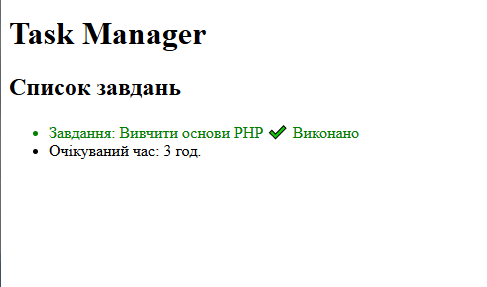
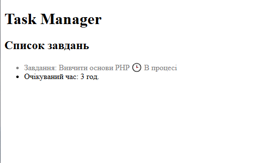

# Лабораторна робота №2

## 1. Фрагмент коду 
```php
<?php
...
$isCompleted = true;
?>
...
<style>
        .task-done {
            color: green;
            text-decoration: line-through;
        }
        .task-pending {
            color: gray;
        }
    </style>
...
        <ul>
            <li class="<?= $isCompleted ? 'task-done' : 'task-pending' ?>">
                Завдання: <?= $taskTitle ?> 
                <?php if ($isCompleted == true): ?>
                    ✔️ Виконано
                <?php else: ?>
                    🕒 В процесі
                <?php endif; ?>
            </li>
            <li>Очікуваний час: <?= $taskTimeEstimate ?> год.</li>
        </ul>




## 3. Відповіді на контрольні запитання

* **Які оператори порівняння існують у PHP (назвіть мінімум 4)?**
  == (дорівнює), != (не дорівнює), > (більше), < (менше), >= (більше або дорівнює), <= (менше або дорівнює)

* **У чому різниця між тотожним порівнянням (===) та звичайним прирівнюванням (==) у PHP? Наведіть приклад, де результати відрізнятимуться.**
  == порівнює лише значення з автоматичним перетворенням типів, а === порівнює і значення, і типи даних 
  Приклад: "5" == 5 дасть true, а "5" === 5 дасть false

* **Для чого потрібен альтернативний синтаксис керуючих конструкцій (if (...): … endif;) під час роботи з HTML?**
  Щоб не плутатися у фігурних дужках { } і робити код чистішим під час змішування PHP з HTML

* **Що таке тернарний оператор і який він має синтаксис? Коли його використання є недоцільним?**
  Це короткий запис if-else
  Синтаксис: умова ? якщо_правда : якщо_брехня
  Недоцільно використовувати для складних або довгих умов, бо код стає заплутаним і складним для прочитання

* **Які значення в PHP приводяться до false при перетворенні типів (type juggling) в умові if?**
  Булевий false, число 0, порожній рядок, порожній масив та null 