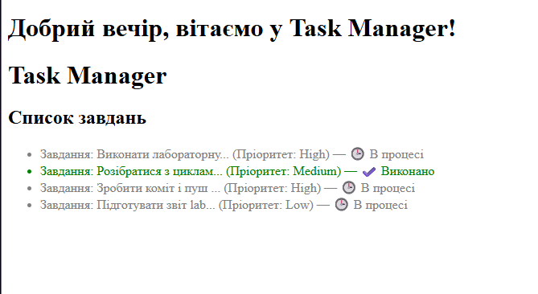

# Лабораторна робота №5

## 1. Структура масиву $tasks
```php
$tasks = [
    [
        'id' => 1,
        'title' => 'Виконати лабораторну роботу №5 з PHP',
        'priority' => 'High',
        'is_completed' => false
    ],
    [
        'id' => 2,
        'title' => 'Розібратися з циклами foreach та масивами',
        'priority' => 'Medium',
        'is_completed' => true
    ],
    [
        'id' => 3,
        'title' => 'Зробити коміт і пуш на GitHub',
        'priority' => 'High',
        'is_completed' => false
    ],
    [
        'id' => 4,
        'title' => 'Підготувати звіт lab5.md',
        'priority' => 'Low',
        'is_completed' => false
    ]
];

...

<ul>
    <?php foreach ($tasks as $task): ?>
        <li class="<?= $task['is_completed'] ? 'task-done' : 'task-pending' ?>">
            Завдання: <?= formatTitle($task['title']) ?> 
            (Пріоритет: <?= $task['priority'] ?>) — 
            <?php if ($task['is_completed']): ?>
                ✔️ Виконано
            <?php else: ?>
                🕒 В процесі
            <?php endif; ?>
        </li>
    <?php endforeach; ?>
</ul>
```



## 3. Відповіді на контрольні запитання

* **В чому принципова різниця між індексованими та асоціативними масивами в PHP? Наведіть фрагменти коду з прикладами.**
  В індексованих масивах індексами є автоматичні числа (починаючи з 0), а в асоціативних — імена, які задаються самостійно
  Індексованиий: $colors = ['red', 'green', 'blue'];
  Асоціативний: $user = ['name' => 'Оля', 'age' => 20];

* **Які ключові компоненти містить цикл foreach? Чому його використання для масивів є кращим за цикл for?**
  Він містить вхідний масив, змінну-псевдонім для поточного елемента і тіло циклу
  foreach набагато зручніший і кращий за звичайний for, оскільки сам автоматично перебирає всі елементи від початку до кінця без потреби рахувати довжину масиву чи індекси вручну

* **Що буде, якщо у foreach звернутися до ключа, якого не існує в асоціативному масиві (наприклад, $task['deadline'])?**
  PHP виведе попередження і продовжить виконання сторінки, підставивши порожнє значення

* **Для чого ми використовуємо альтернативний синтаксис endforeach; замість фігурних дужок } в HTML-шаблонах?**
  Альтернативний синтаксис робить код усередині HTML набагато чистішим і легшим для читання, оскільки одразу видно структуру шаблону без плутанини у дужках

* **Наведіть мінімум 3 приклади корисних вбудованих функцій PHP для роботи з масивами (наприклад, для кількості, сортування тощо) та коротко опишіть їх.**
  count($array) — повертає кількість елементів у масиві
  array_push($array, $element) — додає новий елемент у кінець масиву
  in_range / in_array($value, $array) — перевіряє, чи існує певне значення всередині масиву
