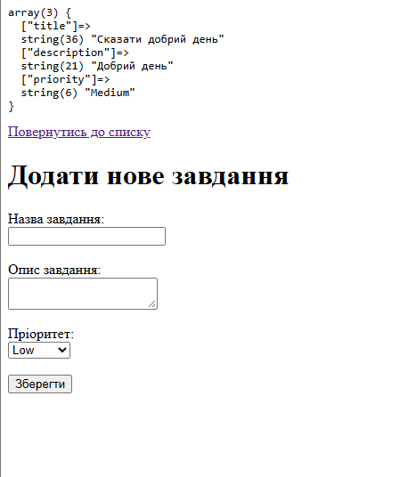

# Лабораторна робота №6

## 1. Форма створення завдання 

```php
<?php
if ($_SERVER['REQUEST_METHOD'] === 'POST') {
    echo "<pre>";
    var_dump($_POST);
    echo "</pre>";
}
?>
<!DOCTYPE html>
<html lang="uk">
<head>
    <meta charset="UTF-8">
    <title>Створити завдання</title>
</head>
<body>
    <a href="index.php">Повернутись до списку</a>
    <h1>Додати нове завдання</h1>
    
    <form action="create.php" method="POST">
        <div>
            <label>Назва завдання:</label><br>
            <input type="text" name="title" required>
        </div>
        <div>
            <label>Опис завдання:</label><br>
            <textarea name="description"></textarea>
        </div>
        <div>
            <label>Пріоритет:</label><br>
            <select name="priority">
                <option value="Low">Low</option>
                <option value="Medium">Medium</option>
                <option value="High">High</option>
            </select>
        </div>
        <button type="submit">Зберегти</button>
    </form>
</body>
</html>
```



## 3. Відповіді на контрольні запитання

* **Назвіть 3 ключові відмінності між HTTP-методами GET та POST під час передачі даних з форми.**
  GET передає дані у відкритому вигляді через URL і використовується для отримання інформації. 
  POST передає дані приховано в тілі запиту, не має обмежень за обсягом і застосовується для створення чи зміни даних 

* **Вкажіть, в яких ситуаціях передача даних методом GET (відкритим текстом в URL) є прийнятною, і чому не можна передавати таким чином паролі.**
  GET є прийнятним для простих пошукових запитів чи фільтрів каталогу. Паролі так передавати не можна, бо вони одразу з'являються в адресному рядку, назавжди зберігаються в історії браузера та логах сервера і стають доступними стороннім

* **За що відповідає HTML-атрибут action у тегу <form>?**
  Він відповідає за визначення шляху або файла-обробника, куди саме будуть спрямовані дані з форми після натискання кнопки відправки

* **За яким критерієм PHP асоціюватиме дані з форми з ключами у масиві $_POST (які HTML атрибути тут вирішальні)?**
  PHP зв'язує дані завдяки атрибуту name у полях введення, оскільки значення цього атрибута автоматично стає ключем для відповідного елемента масиву

* **Назвіть призначення функції var_dump() та тегу <pre>. Чи використовується цей код у продуктовому (Production) середовищі для реальних клієнтів?**
  var_dump() виводить тип і детальне значення змінної чи масиву, а тег <pre> форматує цей вивід, зберігаючи відступи й переноси рядків для зручності читання 
  
  Такий код ніколи не використовується у продуктовому середовищі, оскільки це розкриває технічну внутрішню структуру програми та створює загрозу безпеці