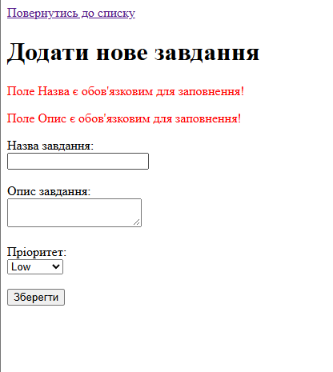

# Лабораторна робота №7

## 1. Фрагмент коду валідації

```php
<?php
if ($_SERVER['REQUEST_METHOD'] === 'POST') {
    $title = htmlspecialchars(trim($_POST['title'] ?? ''));
    $description = htmlspecialchars(trim($_POST['description'] ?? ''));
    $priority = $_POST['priority'] ?? 'Low';

    if (empty($title)) {
        $errors[] = "Поле Назва є обов'язковим для заповнення!";
    }
    if (empty($description)) {
        $errors[] = "Поле Опис є обов'язковим для заповнення!";
    }
}
```



## 3. Відповіді на контрольні запитання

* **У чому принципова різниця між валідацією на фронтенді (через атрибут required в HTML / або на JS) та на бекенді (PHP)?**
  У фронтенді це перевірка в браузері, а для бекенду — це перевірка вже на сервері через PHP. 
  Фронтенд роблять для зручності, а бекенд — для надійності, бо його контролює сервер, а не браузер

* **Чому серверна валідація є критично необхідною з точки зору безпеки? Хто і як може обійти вашу HTML required-валідацію?**
  HTML-перевірку дуже легко обійти, змінивши код сторінки в браузері через F12 або надіслати запит на сервер напряму без самої форми 
  Якщо не перевіряти дані на бекенді через PHP, на сайт можна закинути що завгодно або зламати його

* **Що робить функція trim()? Яку конкретну проблему (наприклад, при реєстрації пароля чи логіна) вона вирішує?**
  Вона стирає зайві пробіли на початку та в кінці слова
  Потрібна для того, щоб людина не могла ввести пробіли замість назви і обійти перевірку на порожнечу

* **Від чого захищає функція htmlspecialchars()? Наведіть приклад “поганого” тексту, який міг би зламати відображення сайту без цього захисту.**
  Вона захищає від хакерських втручань 
  Наприклад, якщо хтось спробує ввести в поле замість назви шкідливий коду чи скрипт, ця функція перетворить його на звичайний текст, який просто безпечно виведеться на екрані, не зламавши сторінку

* **Що таке масив помилок (Error Bag) і чому краще збирати всі помилки та показувати їх одночасно, а не використовувати die() чи exit() при першій-ліпшій невідповідності?**
  Це звичайний масив, куди збираються всі помилдки, якщо користувач щось заповнив неправильно
  Їх потрібно збирати усі разом, щоб користувач одразу бачив весь список помилок, а не виправляв їх по одній кілька разів